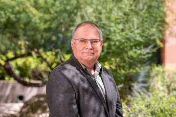

# Profile

{: align=right/left width="50%"}

Dr. Carlos Lizárraga is an educator in computational and data scientist at the University of Arizona Data Science Institute. His advisory and training activities are backed by his proficiency in scientific computing and information technologies.

Dr. Lizárraga is an applied research scientist and retired professor from the Physics Department at the University of Sonora, Mexico. There, he taught mathematical physics and computational physics courses using Python for data analysis and numerical computing.

He was actively involved in the implementation of the computer science program and the development of initial high-performance and high-availability clusters for academic activities support on information technologies skills development programs.

Additionally, he actively participated in the Climate Change Research Program at Universidad Nacional Autónoma de México’s continuous outreach activities.

***

## Education

* Ph.D. Water and Environmental Sciences (2010). [Instituto Tecnológico de Sonora (ITSON)](https://www.itson.mx/)
* M.Sc. Applied Mathematics (1990), [The University of Arizona (UofA)](https://www.arizona.edu/).
* M.Sc. Physics (1980). [Universidad Nacional Autónoma de México (UNAM)](https://www.unam.mx/)
* B.Sc. Physics (1978). [Universidad de Sonora (UNISON)](https://www.unison.mx/)

## Professional Experience

* _Computational and Data Scientist Educator_. [Data Science Institute, The University of Arizona](https://www.datascience.arizona.edu/) (2022 – present)
* _Professor_. [Physics Department, Universidad de Sonora](https://fisica.unison.mx/) (1990 – 2021)
* _Data Analyst Contractor_. [Duarte & Associates](https://sites.google.com/duarteagrib.com/duarteassociates/) (2020 – 2021)
* _Visiting Researcher_. [School of Sustainable Engineering and the Built Environment. Arizona State University](https://ssebe.engineering.asu.edu/) (2020)
* _Business Analytics Contractor_. [NearSoft Inc. / Encora](https://www.encora.com/) (2019 – 2020)
* _Business Data Analyst_. [Tiempo Development Inc. / 3Pillar Global](https://www.3pillarglobal.com/) (2013 – 2017)
* _System Analyst_. [Mathematics Department, The University of Arizona](https://www.math.arizona.edu/) (1992)

## UArizona Data Science

* [Data Science Institute Training](https://workshops-uad7.github.io)
* [Data Science Learning Resources](https://github.com/ua-data7/LearningResources/wiki)

## My GitHub Stats {width="35"}

 

<!-- GitHub section: END -->
